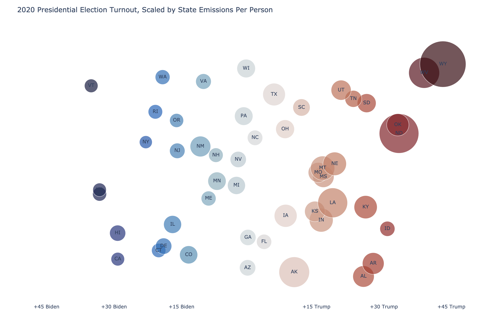

# 2020 US Presidential Election Turnout
## Point sizes scaled by MMTCO2e per person

In this repository, I use publicly available data from the EPA on CO2 emissions and publicly available 2020 presidential election data to create a scatterplot of voter turnout by state against emissions per person per state. The colorscale is meant to reflect the party preference of the state in the 2020 election, as indicated by the values on the X-axis. 

Example:

